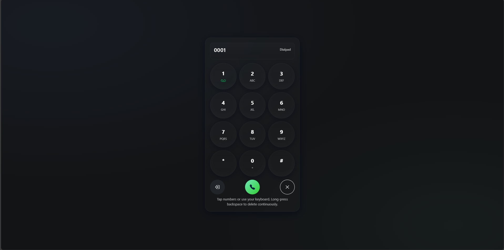
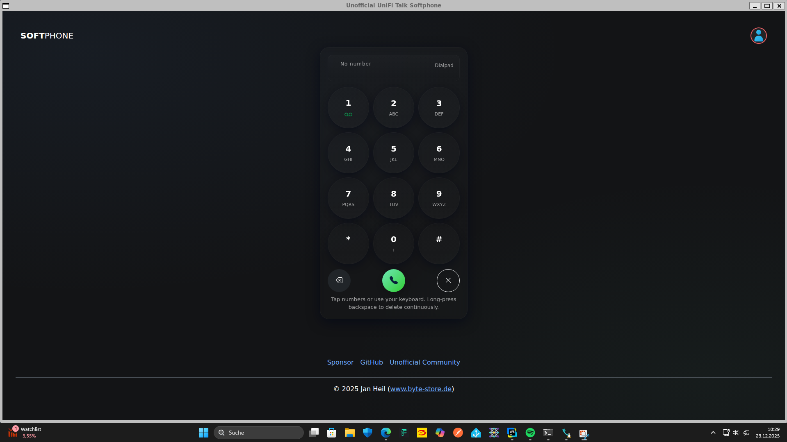
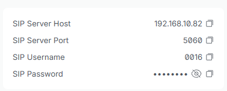

# UniFi Softphone

Another little weekend project of mine.

Since the Talk Softphone is currently only available for paid memberships, here is my free2use version.

Unfortunately, there are no paid memberships available in countries outside the USA.

Contributions are welcome, maybe something nice will come of it :)

## Current Implementation

- Make a Call ✔️
- Hangup Call ✔️
- Accept Call ✔️
- Reject Call ✔️
- Contacts ❌
- Unregister (Do not disturb) ❌
- Caller Log ❌
- Hold a Call ❌
- Mailbox ❌

## Installation

#### Linux:

For Linux please download the latest Release from the [Releases](https://github.com/Gamer08YT/UniFi-Softphone/releases)
page.

Run sudo `apt install ./unofficialunifitalksoftphone_1.0.0_amd64.deb`

With `unofficialunifitalksoftphone` you can start the Client.

#### Windows:

Please download the Client directly from the Windows Store: https://www.microsoft.com/store/apps/9MSTDQNVN4HP

#### MacOS:

Currently there is no MacOS Version available, you need to build it yourself.

Clone the Repository and run `npm install && npm run make`.

This will create a `out` Folder with the Client inside the DMG Folder.

### HTTPS Issue:

If you like to use the Softphone over HTTPS, you need to change the WebSocket Server from FreeSwitch in your UniFi
Console to the ``wss`` Protocol, otherwise your Browser will reject a connection from any HTTPS Site to an WS Server.

But you can use the Softphone over HTTP, since it is just a WebRTC Client and don't send any Traffic/Authorization Data
to the Webserver wich is hosted on.

Keep in mind, that most Browsers will block, Microphone access if Website are hosted on HTTPS.

[//]: # (I created an example Website for this purpose: http://softphone.byte-store.de/)

<b>The easiest option is to use the Windows Store Version or Local in your Browser.</b>

### Account Setup:

Create a new account on the UniFi Talk Server under [Devices](https://unifi/talk/phones/add-device).

**Please check if the SIP Server Hostname is the local IP of your UniFi Talk Server (theres an Bug, where Talk shows a
Hostname of an WAN Interface in the current version).**

If you use the DNS Server of your UniFi Controller, it should be fine to use ``unifi``.

### Function principle

The Client is using WebRTC to connect to the internal UniFi Talk SIP Server (based
on [FreeSwitch](https://developer.signalwire.com/freeswitch/FreeSWITCH-Explained/)).

I used the [SIP.js](https://sipjs.com/guides/server-configuration/freeswitch/) library to connect to the server.

If you want to use it externally, you need to forward port 5060 and 5066 which is very unsecure.

**Remind your credentials are stored in the Browser LocalStorage, to keep your data safe, local at your side and my
project small 😂.**

### License

- Icons are based on ``Windows 11 Color`` by Icons8.com
- VOIP Client is base on ``SIP.js``
- Stylesheet is based on ``Bootstrap 5``

### See my other UniFi projects here:

https://gamer08yt.github.io/UniFi-Talk-Repo/

**This project is not affiliated with Ubiquiti in any way.**